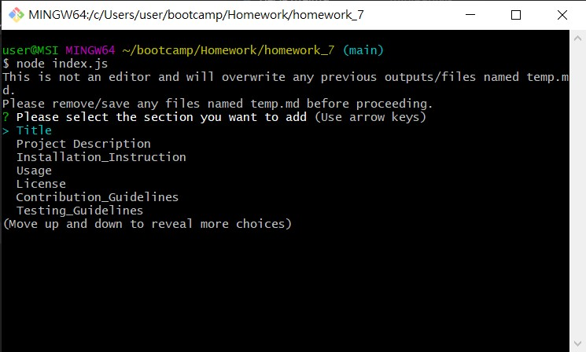
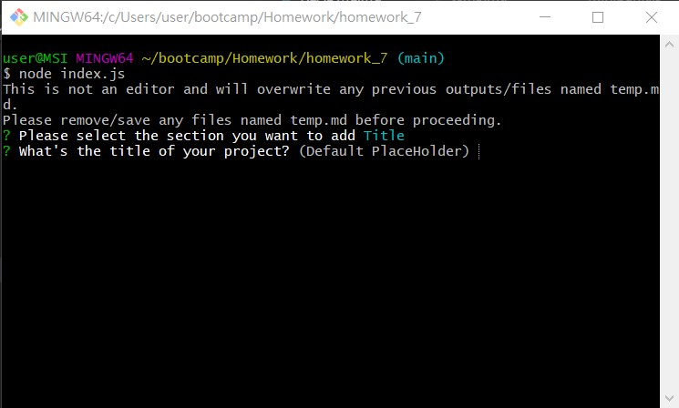
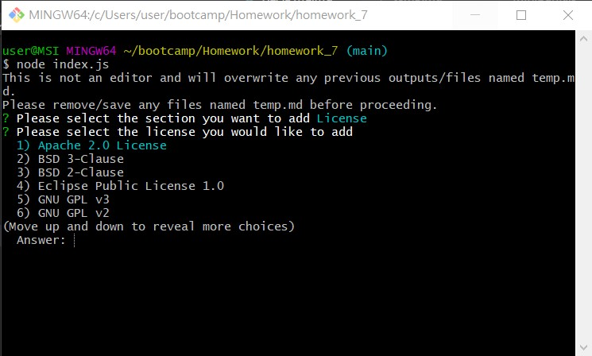
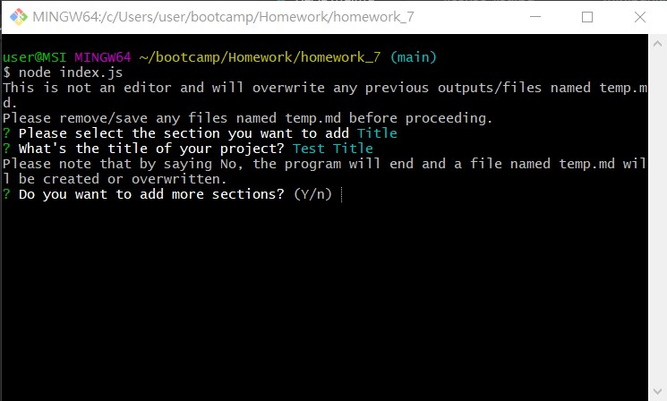
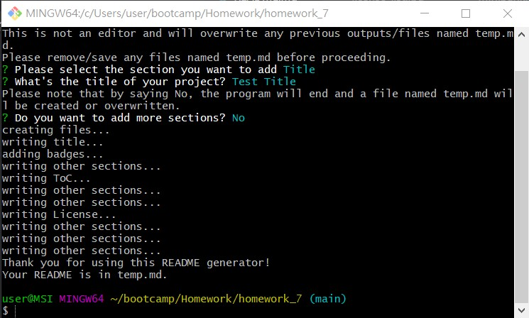
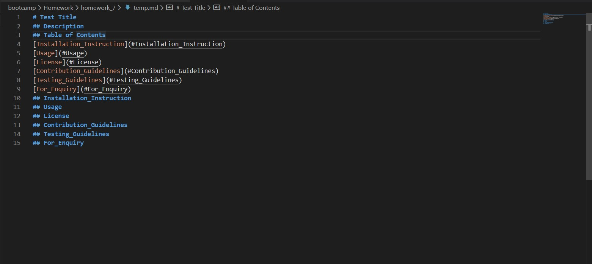

# README-Generator
Goal: To make a markdown generator for making quality README.md for Github
This project has the following abilities:
- Generate a README.md with **Title**, **Project Description**, **Table of Contents** with working links and instructions/information on **Installation**, **Usage**, **License**, **Contributing**, **Testing** and **Enquiry**
- Able to add content to individual sections mentioned above
- Able to select licenses from a list -> Corresponding badges will be added to the top of README and appropriate info will be added to the License section
- Able to add github link and email address
- Able to write the README in a sequential order as listed above.
- Able to output the generated README as **temp.md**

 

This project contains the following files:
- index.js: Contains core logic on prompting the user for content and generating the README
- utils/generateMarkDown.js: Contains markdown formatters and license badges and info
- parkage.json: Contains info on npm packages used
- parkage-lock.json: Auto generated file when installing npm packages

 

This project was made using **Node.js** and **Inquirer** package.  

## Using the generator
- The sequence can be started using **node index.js**
- After selecting a section to add, you will be prompted for content input or selecting item from a list.
- You will be prompted if you have more to add every time after you finished input for a section.
  - If you answered **No**, the program will end and the README will be generated with all the headers and the content you have entered so far.
- This generator will create a new file named **temp.md** for storing the generated README.
  - **temp.md** will be created within the same directory of the generator.
  - **CAUSTIONS**: If you have used this generator before, any previous output or file named **temp.md** will be **overwritten**.
  
### Showcase video
https://drive.google.com/file/d/1sSV6_tPVrgjQ_LVuhKDTPrV4uXuEltWX/view?usp=sharing

### Main menu

### Input

### List

### Confirm prompt

### Generating

### Example

